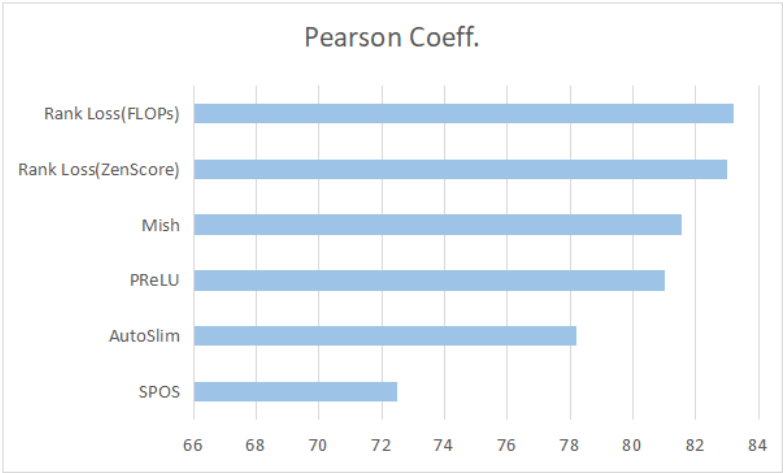
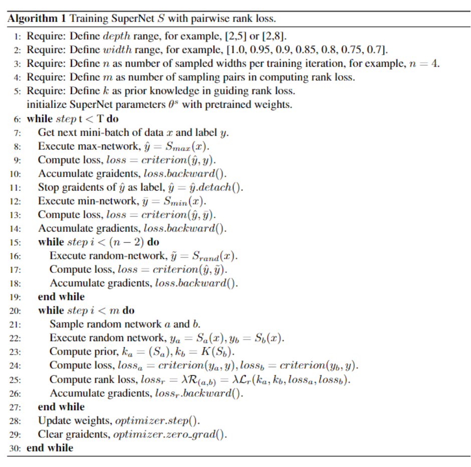

# Prior-Guided One-Shot NAS for CVPR21 workshop

这是CVPR 2022 NAS workshop Track1 第三名方案，包含了独立训练子网络代码以及supernet训练代码。

开发流程：https://gitlab.com/pprp/rcnas 

最优权重: 链接：https://pan.baidu.com/s/1bXcJmFk-BGYca0wdQw9Jkg 提取码：bxvg

提交json: 链接：https://pan.baidu.com/s/1d9klyWTrxWR26lp2ITZrSQ 提取码：oxzr

> 注：开源代码中对应多个分支，分别对应不同的技术方案实现，欢迎Star,Fork,PR! 我们最终的方案对应的是main branch。


## 1. 技术方案

有关技术方案的中英文细节，请查看 [tutorial](https://github.com/pprp/CVPR2022-NAS-competition-Track1-3th-solution/blob/main/tutortial.ipynb) 或者访问 [AI Studio](https://aistudio.baidu.com/aistudio/projectdetail/4061466?shared=1), 选择V100 32GB进行训练。

其中包括：

- 中文版详细说明，以及对应的实验结果。
- 英文版复现说明，能够在AI Studio中直接运行。



## 2. 代码审查 

本项目Code基于官方提供的[Baseline](https://github.com/xiteng01/CVPR_2022_Track1_demo) ，在其基础上实现了一系列最新算法，包括但不限于：

- Single Path One Shot 
- FairNAS 
- Once for all
- AutoSlim/BigNAS
- AlphaNet Loss 
- Ranking Loss 
- ZenScore Computation
- FLOPs Computation 
- Activation (mish, prelu, swish, relu)

主要开发代码集中于hnas，以及utils。

```
- hnas 
	- dataset 
	- models # 新增了激活函数修改
	- utils # 新增了alpha,zenscore,flops,rankloss 以及核心代码hapi_wrapper
		- alphanet_loss.py 
		- compute_zen_score.py 
		- flops_calculation.py 
		- hapi_wrapper.py 
		- pairwise_rank.py 
- paddleslim # 主要使用nas部分代码，新增了autoslim的几个函数方法 
- utils # 常用的工具箱
	- convert_model.py # 转key脚本
	- distance_calc.py # hamming distance计算脚本
	- kendall.py # 计算肯德尔系数以及皮尔逊系数 
	- split_json.py # 划分json文件，并行推理	
```

其中有关核心的方案实现在`hnas/utils/hapi_wrapper.py`中实现，建议配合伪代码进行审查



- PReLU+FLOPs引导的Rank Loss方案对应： https://github.com/pprp/CVPR2022-NAS-competition-Track1-3th-solution/blob/67fa9e464d4116fe770377eb3434dd9007f4e595/hnas/utils/hapi_wrapper.py#L138 
- Mish+ZenScore引导的Rank Loss方案对应：https://github.com/pprp/CVPR2022-NAS-competition-Track1-3th-solution/blob/67fa9e464d4116fe770377eb3434dd9007f4e595/hnas/utils/hapi_wrapper.py#L229

> 注：整个过程中没有使用stand alone真实准确率进行反向传播，可以在以上两个函数的loss.backward之前进行检查。

## 3. 方案复现流程

- 环境准备： `pip install -r requirements.txt`

- 将官方提供的[pretrained model](https://aistudio.baidu.com/aistudio/datasetdetail/134077) 下载至checkpoints文件夹中。

- 将[CVPR_2022_NAS_Track1_test.json](https://aistudio.baidu.com/aistudio/datasetdetail/134077) 下载至checkpoints文件夹中。

- 下载Kaggle上提供的[ImageNet-mini](https://www.kaggle.com/datasets/ifigotin/imagenetmini-1000) 作为训练集和验证集。

- 修改 `train_supernet.sh` 中的`IMAGE_DIR`字段，指向数据集所在位置(资源允许情况下，可以将数据集放在内存中)，运行bash脚本: 

```
bash train_supernet.sh 
```

- 在完成训练后，会在checkpoints文件夹下生成 `checkpoints/reproduct_rank_loss_flops_sanwich` 文件夹，其中保存着模型的权重:`final.pdparams`

- 如果使用单卡测试，需要将权重中的key进行修改, 提供了转化的脚本，将多GPU下保存的权重进行修改：`utils/convert_model.py` ，需要修改 ：https://github.com/pprp/CVPR2022-NAS-competition-Track1-3th-solution/blob/5cc32190994a26853f74ceef53fc8e0e25b88200/utils/convert_model.py#L41-L42 的内容。

- 开始进行验证过程：

```bash
bash eval_supernet.sh checkpoints/CVPR_2022_NAS_Track1_test.json
```

- 验证完成后会请访问 `checkpoints/submit_results.json` 得到生成的对应的可提交结果。


## 4. 参考项目

感谢以下开源项目，在开发过程中受到了以下项目的启发。

https://github.com/idstcv/ZenNAS

https://github.com/xiteng01/CVPR_2022_Track1_demo

https://github.com/facebookresearch/deit

https://github.com/mit-han-lab/once-for-all

https://github.com/facebookresearch/AlphaNet

https://github.com/JiahuiYu/slimmable_networks

https://github.com/open-mmlab/mmrazor

https://github.com/kcyu2014/nas-landmarkreg

https://github.com/megvii-model/SinglePathOneShot

https://github.com/xiaomi-automl/FairNAS

